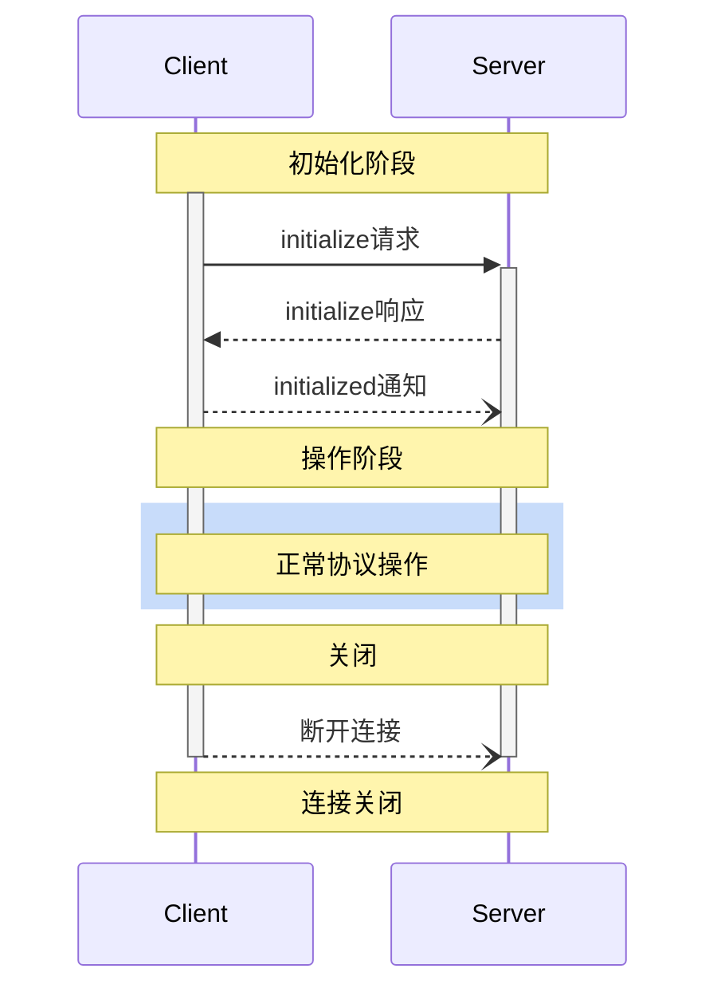

<Info>**协议版本**: 2025-03-26</Info>

模型上下文协议（MCP）为客户端-服务器连接定义了严格的生命周期，确保正确的能力协商和状态管理。

1. **初始化**：能力协商和协议版本协议
2. **操作**：正常协议通信
3. **关闭**：连接的优雅终止



## 生命周期阶段

### 初始化

初始化阶段**必须**是客户端和服务器之间的第一次交互。
在此阶段，客户端和服务器：

- 建立协议版本兼容性
- 交换和协商能力
- 共享实现细节

客户端**必须**通过发送包含以下内容的`initialize`请求来启动此阶段：

- 支持的协议版本
- 客户端能力
- 客户端实现信息

```json
{
  "jsonrpc": "2.0",
  "id": 1,
  "method": "initialize",
  "params": {
    "protocolVersion": "2024-11-05",
    "capabilities": {
      "roots": {
        "listChanged": true
      },
      "sampling": {}
    },
    "clientInfo": {
      "name": "ExampleClient",
      "version": "1.0.0"
    }
  }
}
```

初始化请求**不得**作为JSON-RPC[批处理](https://www.jsonrpc.org/specification#batch)的一部分，因为在初始化完成之前，其他请求和通知是不可能的。这也允许与不明确支持JSON-RPC批处理的先前协议版本向后兼容。

服务器**必须**响应其自身的能力和信息：

```json
{
  "jsonrpc": "2.0",
  "id": 1,
  "result": {
    "protocolVersion": "2024-11-05",
    "capabilities": {
      "logging": {},
      "prompts": {
        "listChanged": true
      },
      "resources": {
        "subscribe": true,
        "listChanged": true
      },
      "tools": {
        "listChanged": true
      }
    },
    "serverInfo": {
      "name": "ExampleServer",
      "version": "1.0.0"
    },
    "instructions": "客户端的可选指令"
  }
}
```

成功初始化后，客户端**必须**发送`initialized`通知，表明它已准备好开始正常操作：

```json
{
  "jsonrpc": "2.0",
  "method": "notifications/initialized"
}
```

- 在服务器响应`initialize`请求之前，客户端**不应该**发送除[ping](/specification/2025-03-26/basic/utilities/ping)之外的请求。
- 在收到`initialized`通知之前，服务器**不应该**发送除[ping](/specification/2025-03-26/basic/utilities/ping)和[日志记录](/specification/2025-03-26/server/utilities/logging)之外的请求。

#### 版本协商

在`initialize`请求中，客户端**必须**发送它支持的协议版本。这**应该**是客户端支持的_最新_版本。

如果服务器支持请求的协议版本，它**必须**响应相同的版本。否则，服务器**必须**响应它支持的另一个协议版本。这**应该**是服务器支持的_最新_版本。

如果客户端不支持服务器响应中的版本，它**应该**断开连接。

#### 能力协商

客户端和服务器能力确定会话期间将可用哪些可选协议功能。

关键能力包括：

| 类别     | 能力           | 描述                                                                     |
| -------- | -------------- | ------------------------------------------------------------------------ |
| 客户端   | `roots`        | 提供文件系统[根目录](/specification/2025-03-26/client/roots)的能力       |
| 客户端   | `sampling`     | 支持LLM[采样](/specification/2025-03-26/client/sampling)请求             |
| 客户端   | `experimental` | 描述对非标准实验性功能的支持                                             |
| 服务器   | `prompts`      | 提供[提示模板](/specification/2025-03-26/server/prompts)                 |
| 服务器   | `resources`    | 提供可读的[资源](/specification/2025-03-26/server/resources)             |
| 服务器   | `tools`        | 公开可调用的[工具](/specification/2025-03-26/server/tools)               |
| 服务器   | `logging`      | 发出结构化[日志消息](/specification/2025-03-26/server/utilities/logging) |
| 服务器   | `experimental` | 描述对非标准实验性功能的支持                                             |

能力对象可以描述子能力，如：

- `listChanged`：支持列表更改通知（适用于提示、资源和工具）
- `subscribe`：支持订阅单个项目的更改（仅限资源）

### 操作

在操作阶段，客户端和服务器根据协商的能力交换消息。

双方**应该**：

- 尊重协商的协议版本
- 只使用成功协商的能力

### 关闭

在关闭阶段，一方（通常是客户端）干净地终止协议连接。没有定义特定的关闭消息——相反，应使用底层传输机制来发出连接终止信号：

#### stdio

对于stdio[传输](/specification/2025-03-26/basic/transports)，客户端**应该**通过以下方式启动关闭：

1. 首先，关闭到子进程（服务器）的输入流
2. 等待服务器退出，或者如果服务器在合理时间内没有退出，则发送`SIGTERM`
3. 如果服务器在`SIGTERM`后的合理时间内没有退出，则发送`SIGKILL`

服务器**可以**通过关闭其到客户端的输出流并退出来启动关闭。

#### HTTP

对于HTTP[传输](/specification/2025-03-26/basic/transports)，关闭通过关闭相关的HTTP连接来指示。

## 超时

实现**应该**为所有发送的请求建立超时，以防止连接挂起和资源耗尽。当请求在超时期限内没有收到成功或错误响应时，发送者**应该**为该请求发出[取消通知](/specification/2025-03-26/basic/utilities/cancellation)，并停止等待响应。

SDK和其他中间件**应该**允许这些超时在每个请求的基础上进行配置。

当收到与请求对应的[进度通知](/specification/2025-03-26/basic/utilities/progress)时，实现**可以**选择重置超时时钟，因为这意味着工作实际上正在进行。然而，实现**应该**始终强制执行最大超时，无论进度通知如何，以限制行为不当的客户端或服务器的影响。

## 错误处理

实现**应该**准备处理这些错误情况：

- 协议版本不匹配
- 无法协商所需的能力
- 请求[超时](#超时)

初始化错误示例：

```json
{
  "jsonrpc": "2.0",
  "id": 1,
  "error": {
    "code": -32602,
    "message": "不支持的协议版本",
    "data": {
      "supported": ["2024-11-05"],
      "requested": "1.0.0"
    }
  }
}
```
