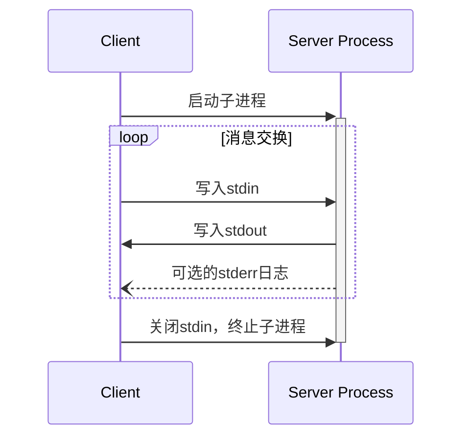
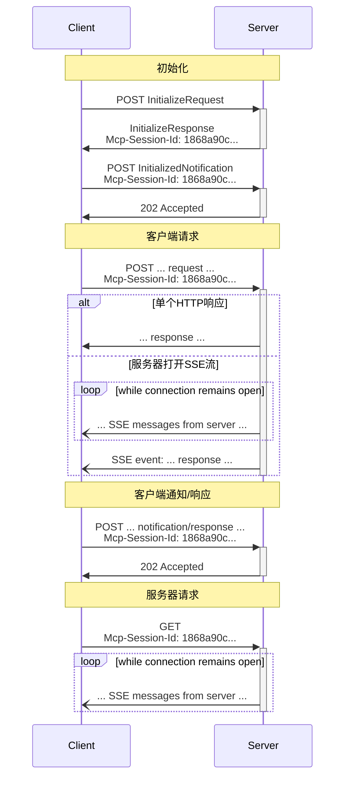

<Info>**协议版本**: 2025-03-26</Info>

MCP使用JSON-RPC编码消息。JSON-RPC消息**必须**使用UTF-8编码。

协议当前定义了两种标准传输机制用于客户端-服务器通信：

1. [stdio](#stdio)，通过标准输入和标准输出进行通信
2. [可流式HTTP](#streamable-http)

客户端**应该**尽可能支持stdio。

客户端和服务器也可以以可插拔方式实现[自定义传输](#custom-transports)。

## stdio

在**stdio**传输中：

- 客户端将MCP服务器作为子进程启动。
- 服务器从其标准输入（`stdin`）读取JSON-RPC消息，并将消息发送到其标准输出（`stdout`）。
- 消息可以是JSON-RPC请求、通知、响应——或包含一个或多个请求和/或通知的JSON-RPC[批处理](https://www.jsonrpc.org/specification#batch)。
- 消息由换行符分隔，并且**不得**包含嵌入的换行符。
- 服务器**可以**为日志记录目的向其标准错误（`stderr`）写入UTF-8字符串。客户端**可以**捕获、转发或忽略此日志记录。
- 服务器**不得**向其`stdout`写入任何不是有效MCP消息的内容。
- 客户端**不得**向服务器的`stdin`写入任何不是有效MCP消息的内容。

## Streamable HTTP

<Info>这取代了协议版本2024-11-05中的[HTTP+SSE传输](/specification/2024-11-05/basic/transports#http-with-sse)。请参阅下面的[向后兼容性](#backwards-compatibility)指南。</Info>

在**可流式HTTP**传输中，服务器作为独立进程运行，可以处理多个客户端连接。此传输使用HTTP POST和GET请求。服务器可以选择使用[服务器发送事件](https://en.wikipedia.org/wiki/Server-sent_events)（SSE）来流式传输多个服务器消息。这允许基本的MCP服务器，以及支持流式传输和服务器到客户端通知和请求的更丰富功能的服务器。

服务器**必须**提供一个支持POST和GET方法的单一HTTP端点路径（以下称为**MCP端点**）。例如，这可能是像`https://example.com/mcp`这样的URL。

#### 安全警告

实现可流式HTTP传输时：

1. 服务器**必须**验证所有传入连接的`Origin`标头，以防止DNS重绑定攻击
2. 在本地运行时，服务器**应该**仅绑定到localhost（127.0.0.1）而不是所有网络接口（0.0.0.0）
3. 服务器**应该**为所有连接实现适当的身份验证

没有这些保护措施，攻击者可能会使用DNS重绑定从远程网站与本地MCP服务器交互。

### 向服务器发送消息

从客户端发送的每个JSON-RPC消息**必须**是对MCP端点的新HTTP POST请求。

1. 客户端**必须**使用HTTP POST向MCP端点发送JSON-RPC消息。
2. 客户端**必须**包含一个`Accept`标头，列出`application/json`和`text/event-stream`作为支持的内容类型。
3. POST请求的正文**必须**是以下之一：
   - 单个JSON-RPC _请求_、_通知_或_响应_
   - 一个[批处理](https://www.jsonrpc.org/specification#batch)一个或多个_请求和/或通知_的数组
   - 一个[批处理](https://www.jsonrpc.org/specification#batch)一个或多个_响应_的数组
4. 如果输入仅由（任意数量的）JSON-RPC _响应_或_通知_组成：
   - 如果服务器接受输入，服务器**必须**返回HTTP状态码202 Accepted，没有正文。
   - 如果服务器无法接受输入，它**必须**返回HTTP错误状态码（例如，400 Bad Request）。HTTP响应正文**可以**包含没有`id`的JSON-RPC _错误响应_。
5. 如果输入包含任意数量的JSON-RPC _请求_，服务器**必须**返回`Content-Type: text/event-stream`以启动SSE流，或返回`Content-Type: application/json`以返回一个JSON对象。客户端**必须**支持这两种情况。
6. 如果服务器启动SSE流：
   - SSE流**应该**最终包含每个在POST正文中发送的JSON-RPC _请求_对应的一个JSON-RPC _响应_。这些_响应_**可以**被[批处理](https://www.jsonrpc.org/specification#batch)。
   - 服务器**可以**在发送JSON-RPC _响应_之前发送JSON-RPC _请求_和_通知_。这些消息**应该**与发起的客户端_请求_相关。这些_请求_和_通知_**可以**被[批处理](https://www.jsonrpc.org/specification#batch)。
   - 服务器**不应该**在为每个收到的JSON-RPC _请求_发送JSON-RPC _响应_之前关闭SSE流，除非[会话](#session-management)过期。
   - 在所有JSON-RPC _响应_都已发送后，服务器**应该**关闭SSE流。
   - 断开连接**可能**随时发生（例如，由于网络条件）。因此：
     - 断开连接**不应该**被解释为客户端取消其请求。
     - 要取消，客户端**应该**明确发送MCP `CancelledNotification`。
     - 为避免由于断开连接导致的消息丢失，服务器**可以**使流[可恢复](#resumability-and-redelivery)。

### 监听来自服务器的消息

1. 客户端**可以**向MCP端点发出HTTP GET请求。这可以用来打开SSE流，允许服务器与客户端通信，而无需客户端先通过HTTP POST发送数据。
2. 客户端**必须**包含一个`Accept`标头，列出`text/event-stream`作为支持的内容类型。
3. 服务器**必须**返回`Content-Type: text/event-stream`以响应此HTTP GET请求，或者返回HTTP 405 Method Not Allowed，指示服务器不提供此端点的SSE流。
4. 如果服务器启动SSE流：
   - 服务器**可以**在流上发送JSON-RPC _请求_和_通知_。这些_请求_和_通知_**可以**被[批处理](https://www.jsonrpc.org/specification#batch)。
   - 这些消息**应该**与任何并发运行的JSON-RPC _请求_无关。
   - 服务器**不得**在流上发送JSON-RPC _响应_，除非[恢复](#resumability-and-redelivery)与先前客户端请求相关的流。
   - 服务器**可以**在任何时候关闭SSE流。
   - 客户端**可以**在任何时候关闭SSE流。

### 多个连接

1. 客户端**可以**同时保持多个SSE流的连接。
2. 服务器**必须**在每个连接的流上发送其JSON-RPC消息；即，它**不得**在多个流上广播相同的消息。
   - 消息丢失的风险**可能**通过使流[可恢复](#resumability-and-redelivery)来降低。

### 可恢复性和重传

为了支持断开连接的恢复和可能丢失的消息的重传：

1. 服务器**可以**将`id`字段附加到其SSE事件，如[SSE标准](https://html.spec.whatwg.org/multipage/server-sent-events.html#event-stream-interpretation)中所述。
   - 如果存在，ID**必须**在会话内的所有流中全局唯一，或在没有会话管理的情况下与特定客户端的所有流中全局唯一。
2. 如果客户端希望在断开连接后恢复，它**应该**向MCP端点发出HTTP GET请求，并包含[`Last-Event-ID`](https://html.spec.whatwg.org/multipage/server-sent-events.html#the-last-event-id-header)标头，以指示它收到的最后一个事件ID。
   - 服务器**可以**使用此标头来重放断开连接后应该发送的消息，并从该点恢复流。
   - 服务器**不得**重放应该在不同流上发送的消息。

换句话说，这些事件ID应该由服务器分配，以在特定流中充当游标。

### 会话管理

MCP“会话”由客户端和服务器之间的逻辑相关交互组成，始于[初始化阶段](/specification/2025-03-26/basic/lifecycle)。为了支持希望建立有状态会话的服务器：

1. 使用可流式HTTP传输的服务器**可以**在初始化时分配会话ID，方法是将其包含在HTTP响应中的`Mcp-Session-Id`标头中，响应包含`InitializeResult`。
   - 会话ID**应该**是全局唯一的和加密安全的（例如，安全生成的UUID、JWT或加密哈希）。
   - 会话ID**必须**仅包含可见的ASCII字符（从0x21到0x7E）。
2. 如果服务器在初始化期间返回`Mcp-Session-Id`，则使用可流式HTTP传输的客户端**必须**在其后续HTTP请求的`Mcp-Session-Id`标头中包含它。
   - 需要会话ID的服务器**应该**响应不包含`Mcp-Session-Id`标头的请求（除了初始化请求），并返回HTTP 400 Bad Request。
3. 服务器**可以**在任何时候终止会话，此后它**必须**响应包含该会话ID的请求，并返回HTTP 404 Not Found。
4. 当客户端收到HTTP 404响应包含会话ID的请求时，它**必须**通过发送不带会话ID的新`InitializeRequest`来启动新会话。
5. 不再需要特定会话的客户端（例如，因为用户离开了客户端应用程序）**应该**向MCP端点发送HTTP DELETE请求，并包含`Mcp-Session-Id`标头，以显式终止会话。
   - 服务器**可以**响应此请求，并返回HTTP 405 Method Not Allowed，指示服务器不允许客户端终止会话。

### 序列图

### 向后兼容性

客户端和服务器可以通过以下方式保持与弃用的[HTTP+SSE传输](/specification/2024-11-05/basic/transports#http-with-sse)（来自协议版本2024-11-05）的向后兼容性：

**服务器**希望支持旧客户端应该：

- 继续托管旧传输的SSE和POST端点，以及新定义的“MCP端点”。
  - 也可以将旧POST端点和新MCP端点合并，但这可能会引入不必要的复杂性。

**客户端**希望支持旧服务器应该：

1. 从用户那里接受MCP服务器URL，它可能指向使用旧传输或新传输的服务器。
2. 尝试向服务器URL发送`InitializeRequest`，带有上面定义的`Accept`标头：
   - 如果成功，客户端可以假设这是一个支持新可流式HTTP传输的服务器。
   - 如果失败并返回HTTP 4xx状态码（例如，405 Method Not Allowed或404 Not Found）：
     - 发出GET请求到服务器URL，期望它将打开SSE流并返回第一个事件`endpoint`。
     - 当`endpoint`事件到达时，客户端可以假设这是一个运行旧HTTP+SSE传输的服务器，并且应该使用该传输进行所有后续通信。

## 自定义传输

客户端和服务器**可以**实现其他自定义传输机制，以满足其特定需求。协议是传输不可知的，可以在支持双向消息交换的任何通信通道上实现。

选择支持自定义传输的实现者**必须**确保它们保留MCP定义的JSON-RPC消息格式和生命周期要求。自定义传输**应该**记录其特定的连接建立和消息交换模式，以促进互操作性。
