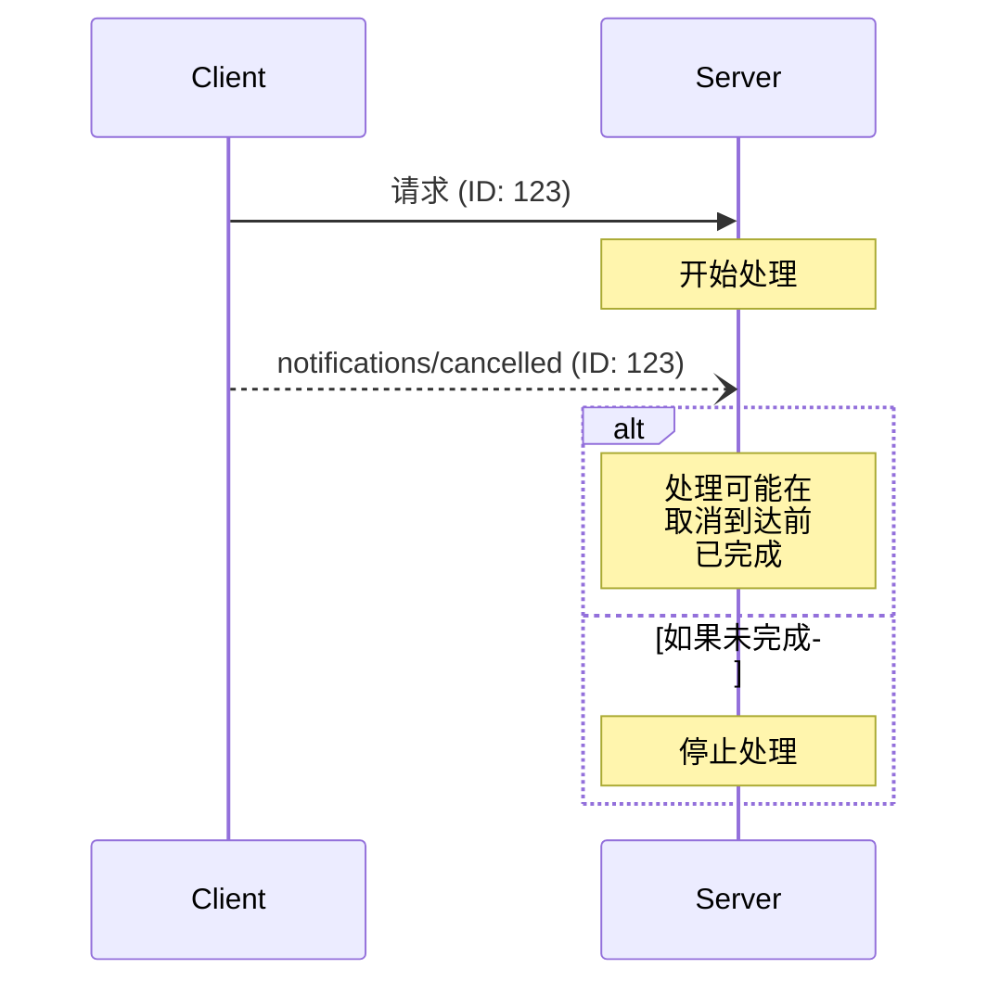

<Info>**协议版本**: 2025-03-26</Info>

模型上下文协议（MCP）通过通知消息支持可选的进行中请求取消。任何一方都可以发送取消通知，表明先前发出的请求应该终止。

## 取消流程

当一方想要取消正在进行的请求时，它会发送一个包含以下内容的`notifications/cancelled`通知：

- 要取消的请求的ID
- 可选的原因字符串，可用于记录或显示

```json
{
  "jsonrpc": "2.0",
  "method": "notifications/cancelled",
  "params": {
    "requestId": "123",
    "reason": "用户请求取消"
  }
}
```

## 行为要求

1. 取消通知**必须**只引用以下请求：
   - 之前在相同方向上发出的请求
   - 被认为仍在进行中的请求
2. 客户端**不得**取消`initialize`请求
3. 取消通知的接收者**应该**：
   - 停止处理被取消的请求
   - 释放相关资源
   - 不为被取消的请求发送响应
4. 接收者**可以**忽略取消通知，如果：
   - 引用的请求未知
   - 处理已经完成
   - 请求无法取消
5. 取消通知的发送者**应该**忽略之后到达的对该请求的任何响应

## 时间考虑因素

由于网络延迟，取消通知可能在请求处理完成后到达，甚至可能在响应已经发送之后到达。

双方**必须**优雅地处理这些竞争条件：



## 实现注意事项

- 双方**应该**记录取消原因以便调试
- 应用程序UI**应该**指示何时请求取消

## 错误处理

无效的取消通知**应该**被忽略：

- 未知的请求ID
- 已完成的请求
- 格式错误的通知

这保持了通知的"发送后忘记"性质，同时允许异步通信中的竞争条件。
