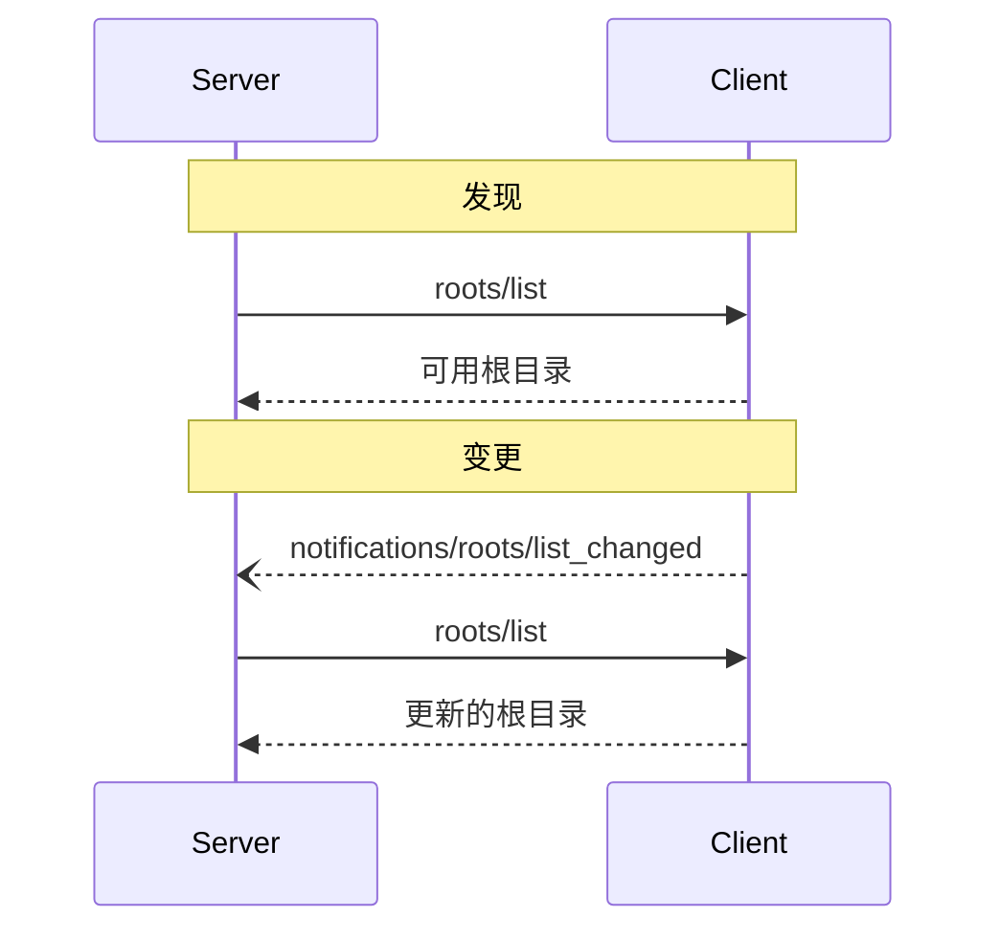

<Info>**协议版本**: 2025-03-26</Info>

模型上下文协议（MCP）提供了一种标准化的方式，使客户端能够向服务器公开文件系统"根目录"。根目录定义了服务器可以在文件系统中操作的边界，使它们能够了解哪些目录和文件是可访问的。服务器可以从支持的客户端请求根目录列表，并在该列表更改时接收通知。

## 用户交互模型

MCP中的根目录通常通过工作区或项目配置界面公开。

例如，实现可以提供一个工作区/项目选择器，允许用户选择服务器应该有权访问的目录和文件。这可以与版本控制系统或项目文件的自动工作区检测相结合。

然而，实现可以通过任何适合其需求的界面模式公开根目录&mdash;协议本身不强制要求任何特定的用户交互模型。

## 能力

支持根目录的客户端**必须**在[初始化](/specification/2025-03-26/basic/lifecycle#initialization)期间声明`roots`能力：

```json
{
  "capabilities": {
    "roots": {
      "listChanged": true
    }
  }
}
```

`listChanged`表示客户端是否会在根目录列表更改时发出通知。

## 协议消息

### 列出根目录

要检索根目录，服务器发送`roots/list`请求：

**请求：**

```json
{
  "jsonrpc": "2.0",
  "id": 1,
  "method": "roots/list"
}
```

**响应：**

```json
{
  "jsonrpc": "2.0",
  "id": 1,
  "result": {
    "roots": [
      {
        "uri": "file:///home/user/projects/myproject",
        "name": "我的项目"
      }
    ]
  }
}
```

### 根目录列表变更

当根目录更改时，支持`listChanged`的客户端**必须**发送通知：

```json
{
  "jsonrpc": "2.0",
  "method": "notifications/roots/list_changed"
}
```

## 消息流



## 数据类型

### 根目录

根目录定义包括：

- `uri`：根目录的唯一标识符。在当前规范中，这**必须**是一个`file://` URI。
- `name`：可选的人类可读名称，用于显示目的。

不同用例的根目录示例：

#### 项目目录

```json
{
  "uri": "file:///home/user/projects/myproject",
  "name": "我的项目"
}
```

#### 多个仓库

```json
[
  {
    "uri": "file:///home/user/repos/frontend",
    "name": "前端仓库"
  },
  {
    "uri": "file:///home/user/repos/backend",
    "name": "后端仓库"
  }
]
```

## 错误处理

客户端**应该**为常见失败情况返回标准JSON-RPC错误：

- 客户端不支持根目录：`-32601`（方法未找到）
- 内部错误：`-32603`

错误示例：

```json
{
  "jsonrpc": "2.0",
  "id": 1,
  "error": {
    "code": -32601,
    "message": "不支持根目录",
    "data": {
      "reason": "客户端没有根目录能力"
    }
  }
}
```

## 安全考虑

1. 客户端**必须**：

   - 只公开具有适当权限的根目录
   - 验证所有根目录URI以防止路径遍历
   - 实施适当的访问控制
   - 监控根目录可访问性

2. 服务器**应该**：

   - 处理根目录变得不可用的情况
   - 在操作期间尊重根目录边界
   - 根据提供的根目录验证所有路径

## 实施指南

1. 客户端**应该**：

   - 在向服务器公开根目录之前提示用户同意
   - 提供清晰的用户界面进行根目录管理
   - 在公开之前验证根目录可访问性
   - 监控根目录变更

2. 服务器**应该**：

   - 在使用前检查根目录能力
   - 优雅地处理根目录列表变更
   - 在操作中尊重根目录边界
   - 适当缓存根目录信息
