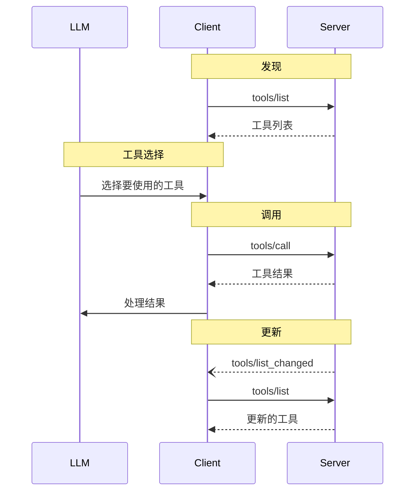

<Info>**协议版本**: 2025-03-26</Info>

模型上下文协议（MCP）允许服务器公开可由语言模型调用的工具。工具使模型能够与外部系统交互，例如查询数据库、调用API或执行计算。每个工具由名称唯一标识，并包含描述其模式的元数据。

## 用户交互模型

MCP中的工具被设计为**模型控制**的，这意味着语言模型可以基于其上下文理解和用户的提示自动发现和调用工具。

然而，实现者可以通过任何适合其需求的界面模式公开工具&mdash;协议本身不强制要求任何特定的用户交互模型。

<Warning>
为了信任、安全和保障，**应该**始终有一个人在循环中，能够拒绝工具调用。

应用程序**应该**：

- 提供清晰显示哪些工具正在向AI模型公开的UI
- 在调用工具时插入清晰的视觉指示器
- 向用户呈现操作确认提示，以确保有人在循环中
</Warning>

## 能力

支持工具的服务器**必须**声明`tools`能力：

```json
{
  "capabilities": {
    "tools": {
      "listChanged": true
    }
  }
}
```

`listChanged`表示服务器是否会在可用工具列表更改时发出通知。

## 协议消息

### 列出工具

要发现可用工具，客户端发送`tools/list`请求。此操作支持[分页](/specification/2025-03-26/server/utilities/pagination)。

**请求：**

```json
{
  "jsonrpc": "2.0",
  "id": 1,
  "method": "tools/list",
  "params": {
    "cursor": "可选的游标值"
  }
}
```

**响应：**

```json
{
  "jsonrpc": "2.0",
  "id": 1,
  "result": {
    "tools": [
      {
        "name": "get_weather",
        "description": "获取位置的当前天气信息",
        "inputSchema": {
          "type": "object",
          "properties": {
            "location": {
              "type": "string",
              "description": "城市名称或邮政编码"
            }
          },
          "required": ["location"]
        }
      }
    ],
    "nextCursor": "下一页游标"
  }
}
```

### 调用工具

要调用工具，客户端发送`tools/call`请求：

**请求：**

```json
{
  "jsonrpc": "2.0",
  "id": 2,
  "method": "tools/call",
  "params": {
    "name": "get_weather",
    "arguments": {
      "location": "纽约"
    }
  }
}
```

**响应：**

```json
{
  "jsonrpc": "2.0",
  "id": 2,
  "result": {
    "content": [
      {
        "type": "text",
        "text": "纽约当前天气：\n温度：72°F\n状况：局部多云"
      }
    ],
    "isError": false
  }
}
```

### 列表变更通知

当可用工具列表发生变化时，声明了`listChanged`能力的服务器**应该**发送通知：

```json
{
  "jsonrpc": "2.0",
  "method": "notifications/tools/list_changed"
}
```

## 消息流



## 数据类型

### 工具

工具定义包括：

- `name`：工具的唯一标识符
- `description`：功能的人类可读描述
- `inputSchema`：定义预期参数的JSON模式
- `annotations`：描述工具行为的可选属性

<Warning>为了信任、安全和保障，客户端**必须**将工具注释视为不受信任的，除非它们来自受信任的服务器。</Warning>

### 工具结果

工具结果可以包含不同类型的多个内容项：

#### 文本内容

```json
{
  "type": "text",
  "text": "工具结果文本"
}
```

#### 图像内容

```json
{
  "type": "image",
  "data": "base64编码数据",
  "mimeType": "image/png"
}
```

#### 音频内容

```json
{
  "type": "audio",
  "data": "base64编码的音频数据",
  "mimeType": "audio/wav"
}
```

#### 嵌入资源

[资源](/specification/2025-03-26/server/resources) **可以**被嵌入，以提供额外的上下文或数据，通过一个URI，客户端稍后可以订阅或再次获取：

```json
{
  "type": "resource",
  "resource": {
    "uri": "resource://example",
    "mimeType": "text/plain",
    "text": "资源内容"
  }
}
```

## 错误处理

工具使用两种错误报告机制：

1. **协议错误**：标准JSON-RPC错误，用于以下问题：

   - 未知工具
   - 无效参数
   - 服务器错误

2. **工具执行错误**：在工具结果中报告，带有`isError: true`：
   - API失败
   - 无效输入数据
   - 业务逻辑错误

协议错误示例：

```json
{
  "jsonrpc": "2.0",
  "id": 3,
  "error": {
    "code": -32602,
    "message": "未知工具：invalid_tool_name"
  }
}
```

工具执行错误示例：

```json
{
  "jsonrpc": "2.0",
  "id": 4,
  "result": {
    "content": [
      {
        "type": "text",
        "text": "获取天气数据失败：API速率限制已超出"
      }
    ],
    "isError": true
  }
}
```

## 安全考虑

1. 服务器**必须**：

   - 验证所有工具输入
   - 实施适当的访问控制
   - 限制工具调用速率
   - 净化工具输出

2. 客户端**应该**：
   - 对敏感操作提示用户确认
   - 在调用服务器之前向用户显示工具输入，以避免恶意或意外的数据泄露
   - 在传递给LLM之前验证工具结果
   - 为工具调用实施超时
   - 记录工具使用情况以供审计
