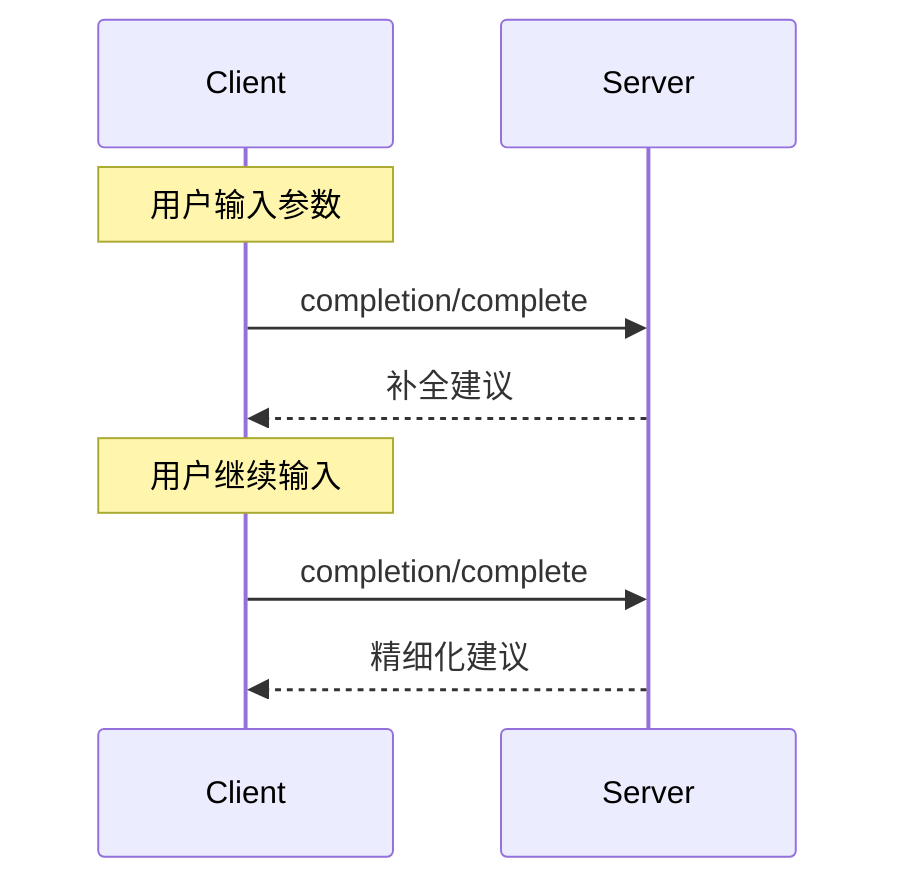

<Info>**协议版本**: 2025-03-26</Info>

模型上下文协议（MCP）提供了一种标准化的方式，使服务器能够为提示和资源URI提供参数自动补全建议。这使得用户在输入参数值时能够获得上下文建议，从而实现类似IDE的丰富体验。

## 用户交互模型

MCP中的补全被设计为支持类似IDE代码补全的交互式用户体验。

例如，应用程序可以在用户输入时以下拉菜单或弹出菜单的形式显示补全建议，并提供从可用选项中筛选和选择的功能。

然而，实现者可以通过任何适合其需求的界面模式公开补全功能&mdash;协议本身不强制要求任何特定的用户交互模型。

## 能力

支持补全的服务器**必须**声明`completions`能力：

```json
{
  "capabilities": {
    "completions": {}
  }
}
```

## 协议消息

### 请求补全

要获取补全建议，客户端发送`completion/complete`请求，通过引用类型指定正在补全的内容：

**请求：**

```json
{
  "jsonrpc": "2.0",
  "id": 1,
  "method": "completion/complete",
  "params": {
    "ref": {
      "type": "ref/prompt",
      "name": "code_review"
    },
    "argument": {
      "name": "language",
      "value": "py"
    }
  }
}
```

**响应：**

```json
{
  "jsonrpc": "2.0",
  "id": 1,
  "result": {
    "completion": {
      "values": ["python", "pytorch", "pyside"],
      "total": 10,
      "hasMore": true
    }
  }
}
```

### 引用类型

协议支持两种类型的补全引用：

| 类型 | 描述 | 示例 |
| -------------- | --------------------------- | --------------------------------------------------- |
| `ref/prompt` | 按名称引用提示 | `{"type": "ref/prompt", "name": "code_review"}` |
| `ref/resource` | 引用资源URI | `{"type": "ref/resource", "uri": "file:///{path}"}` |

### 补全结果

服务器返回按相关性排序的补全值数组，包含：

- 每个响应最多100个项目
- 可选的可用匹配总数
- 表示是否存在额外结果的布尔值

## 消息流



## 数据类型

### CompleteRequest

- `ref`：`PromptReference`或`ResourceReference`
- `argument`：包含以下内容的对象：
  - `name`：参数名称
  - `value`：当前值

### CompleteResult

- `completion`：包含以下内容的对象：
  - `values`：建议数组（最多100个）
  - `total`：可选的匹配总数
  - `hasMore`：额外结果标志

## 错误处理

服务器**应该**为常见失败情况返回标准JSON-RPC错误：

- 方法未找到：`-32601`（不支持的能力）
- 无效的提示名称：`-32602`（无效参数）
- 缺少必需参数：`-32602`（无效参数）
- 内部错误：`-32603`（内部错误）

## 实施考虑

1. 服务器**应该**：

   - 返回按相关性排序的建议
   - 在适当的情况下实现模糊匹配
   - 限制补全请求速率
   - 验证所有输入

2. 客户端**应该**：
   - 防抖快速补全请求
   - 在适当的情况下缓存补全结果
   - 优雅地处理缺失或部分结果

## 安全

实现**必须**：

- 验证所有补全输入
- 实施适当的速率限制
- 控制对敏感建议的访问
- 防止基于补全的信息泄露
