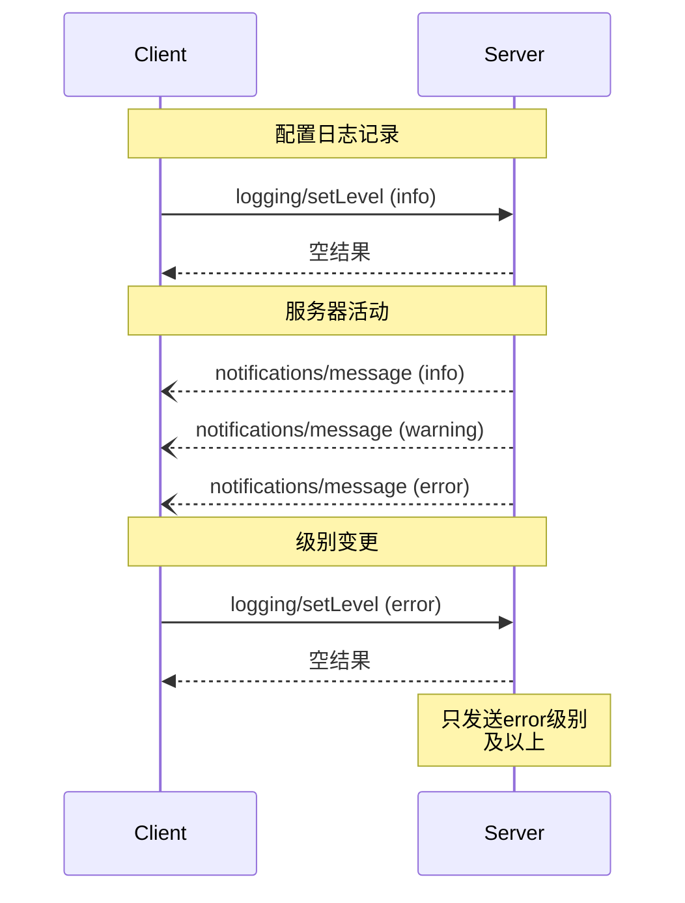

<Info>**协议版本**: 2025-03-26</Info>

模型上下文协议（MCP）提供了一种标准化的方式，使服务器能够向客户端发送结构化日志消息。客户端可以通过设置最低日志级别来控制日志详细程度，服务器发送包含严重性级别、可选的记录器名称和任意JSON可序列化数据的通知。

## 用户交互模型

实现者可以通过任何适合其需求的界面模式公开日志记录&mdash;协议本身不强制要求任何特定的用户交互模型。

## 能力

发出日志消息通知的服务器**必须**声明`logging`能力：

```json
{
  "capabilities": {
    "logging": {}
  }
}
```

## 日志级别

协议遵循[RFC 5424](https://datatracker.ietf.org/doc/html/rfc5424#section-6.2.1)中指定的标准syslog严重性级别：

| 级别 | 描述 | 示例用例 |
| --------- | -------------------------------- | -------------------------- |
| debug | 详细的调试信息 | 函数入口/出口点 |
| info | 一般信息消息 | 操作进度更新 |
| notice | 正常但重要的事件 | 配置更改 |
| warning | 警告条件 | 已弃用功能使用 |
| error | 错误条件 | 操作失败 |
| critical | 严重条件 | 系统组件故障 |
| alert | 必须立即采取行动 | 检测到数据损坏 |
| emergency | 系统不可用 | 完全系统故障 |

## 协议消息

### 设置日志级别

要配置最低日志级别，客户端**可以**发送`logging/setLevel`请求：

**请求：**

```json
{
  "jsonrpc": "2.0",
  "id": 1,
  "method": "logging/setLevel",
  "params": {
    "level": "info"
  }
}
```

### 日志消息通知

服务器使用`notifications/message`通知发送日志消息：

```json
{
  "jsonrpc": "2.0",
  "method": "notifications/message",
  "params": {
    "level": "error",
    "logger": "database",
    "data": {
      "error": "连接失败",
      "details": {
        "host": "localhost",
        "port": 5432
      }
    }
  }
}
```

## 消息流



## 错误处理

服务器**应该**为常见失败情况返回标准JSON-RPC错误：

- 无效的日志级别：`-32602`（无效参数）
- 配置错误：`-32603`（内部错误）

## 实施考虑

1. 服务器**应该**：

   - 限制日志消息速率
   - 在数据字段中包含相关上下文
   - 使用一致的记录器名称
   - 移除敏感信息

2. 客户端**可以**：

   - 在UI中呈现日志消息
   - 实现日志过滤/搜索
   - 视觉上显示严重性
   - 持久化日志消息

## 安全

1. 日志消息**不得**包含：

   - 凭证或密钥
   - 个人身份信息
   - 可能帮助攻击的内部系统详情

2. 实现**应该**：

   - 限制消息速率
   - 验证所有数据字段
   - 控制日志访问
   - 监控敏感内容
